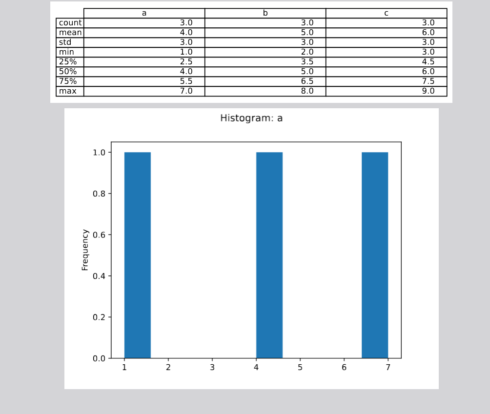

# CLI Report Generator

CLI tool that transforms a CSV file into a summary PDF (statistics + charts).

Files:
- `report.py` - main script
- `data_example.csv` - example data

## Installation
1. Install dependencies:

pip install -r requirements.txt

## Usage

python3 report.py data.csv report.pdf

